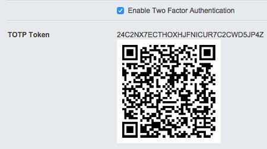
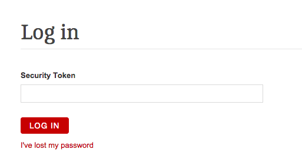
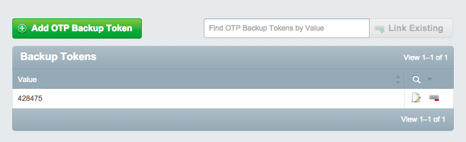

# User guide

## Setting up two factor authentication
Users will need access to view their CMS profile (/admin/myprofile) to enable and manage two factor authentication.

1. Log into the CMS and navigate to your profile's "Two Factor Authentication" tab.
2. Check the "Enable Two Factor Authentication" checkbox and save your profile. This will generate a Timed One-Time Password token and a QR code to set up in your second factor application (Google Authenticator, for example).

    

3. Scan the QR code (or enter the token) into your two factor authentication application and use alongside your regular email and password when logging into the CMS.

    

## Installing Google Authenticator
See the [installation instructions for various mobile devices](https://support.google.com/accounts/answer/1066447?hl=en).

## Setting backup tokens
You can set up backup security tokens just in case you lose access to your second factor device.

1. Log into the CMS and navigate to your profile's "Two Factor Authentication" tab.
2. Click the "Create new two-factor backup tokens" button.
3. Immediately record your new backup tokens and save them securely. Any previous tokens are destroyed.

    

4. You can now use this token in place of two factor authentication.

Tokens are single-use, and each one will be removed from your pool of backup tokens once you have used it.
